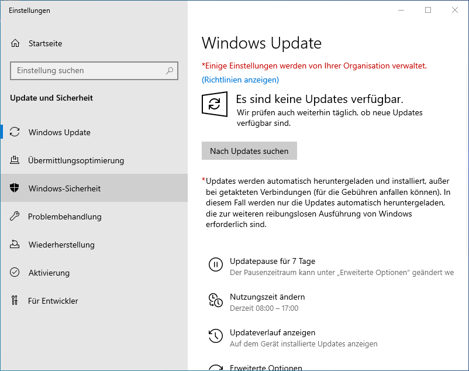
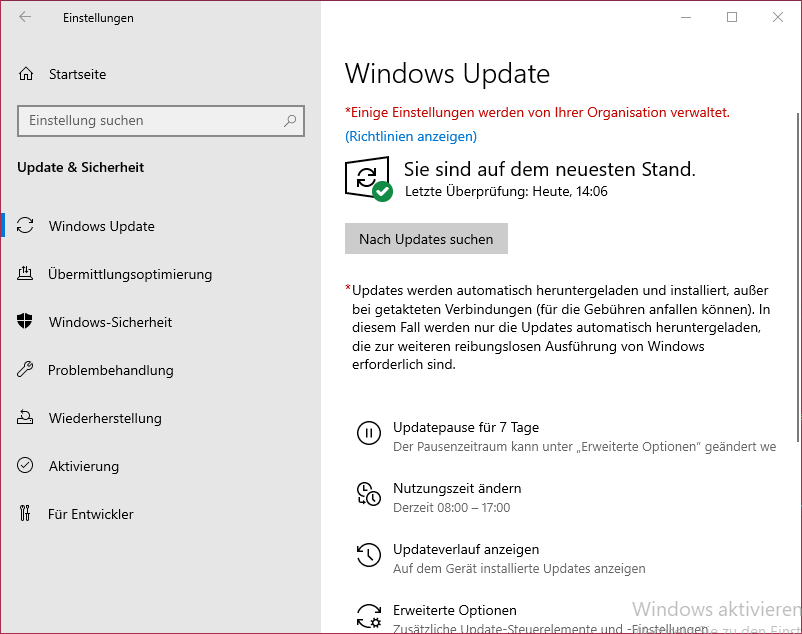

Einrichtung - Grundkonfiguration
=====

Installation von Windows Updates
-----

**1. Windows Update öffnen:**
Dazu im Start Menü "Nach Updates suchen" eingeben

.. image:: ../img/einrichtung/grund/updates/1.png
  :width: 600

**2. Nach Updates suchen:**
Hierzu einfach auf den Button "Nach Updates suchen" klicken. Die Suche durchlaufen lassen.

**3. Updates installieren:**
Wenn Updates gefunden werden, diese selbstverständlich installieren. Falls mehrere Updates verfügbar sind, warten bis ALLE installiert sind, erst dann neu starten, wenn alles fertig ist.
Optional kann der Neustart auch über den Button Neustart planen zu einen späteren Zeitpunkt automatisch erfolgen.

.. image:: ../img/einrichtung/grund/updates/3.png
  :width: 600

**4. Abschließen:**
Wenn alle Updates installiert sind bzw. von Anfang an keine Verfügbar sind, wird dies auch entsprechend angezeigt.

Installation von BGInfo
-----

Feste IP-Adresse vergeben
-----

Rechnernamen ändern
-----
