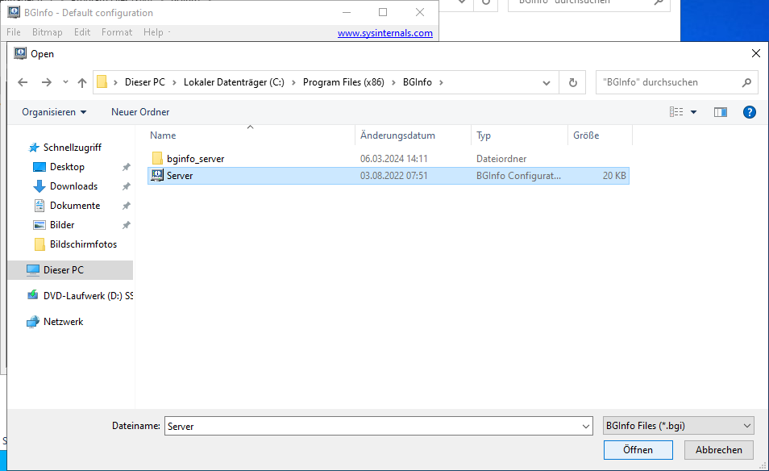
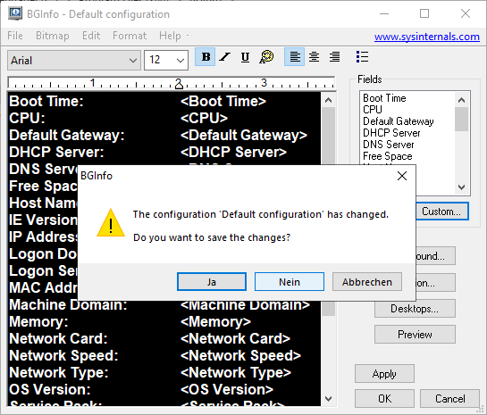

Einrichtung - Grundkonfiguration
=====

Installation von Windows Updates
-----

**1. Windows Update öffnen:**
Dazu im Start Menü "Nach Updates suchen" eingeben

.. image:: ../img/einrichtung/grund/updates/1.png
  :width: 750

**2. Nach Updates suchen:**
Hierzu einfach auf den Button "Nach Updates suchen" klicken. Die Suche durchlaufen lassen.

.. image:: ../img/einrichtung/grund/updates/2.png
  :width: 750

**3. Updates installieren:**
Wenn Updates gefunden werden, diese selbstverständlich installieren. Falls mehrere Updates verfügbar sind, warten bis ALLE installiert sind, erst dann neu starten, wenn alles fertig ist.
Optional kann der Neustart auch über den Button Neustart planen zu einen späteren Zeitpunkt automatisch erfolgen.

.. image:: ../img/einrichtung/grund/updates/3.png
  :width: 750

**4. Abschließen:**
Wenn alle Updates installiert sind bzw. von Anfang an keine Verfügbar sind, wird dies auch entsprechend angezeigt.

.. image:: ../img/einrichtung/grund/updates/4.png
  :width: 750

Installation von BGInfo
-----

1. Passende Vorlage aus dem Vorlagenordner nehmen
2. Ordnerinhalte auf den Server kopieren nach "C:\Program Files (x86)\BGInfo". Sollte wie folgt aussehen:

.. image:: ../img/einrichtung/grund/bg-info/1.png
  :width: 500

3. Die Datei "Create-BGInfoLaunchShortcut" ausführen und anschließend auf "OK" klicken
4. Nun die Datei "Bginfo64" ausführen
5. In dem Fenster das sich öffnet oben links auf "File" > "Open…" klicken.

.. image:: ../img/einrichtung/grund/bg-info/2.png
  :width: 500

6. Dann die Datei "Server" auswählen.

7. Falls die Abfrage kommt, ob die bisherige Konfiguration gespeichert werden soll, den Punkt "Nein" auswählen

Feste IP-Adresse vergeben
-----

Rechnernamen ändern
-----
